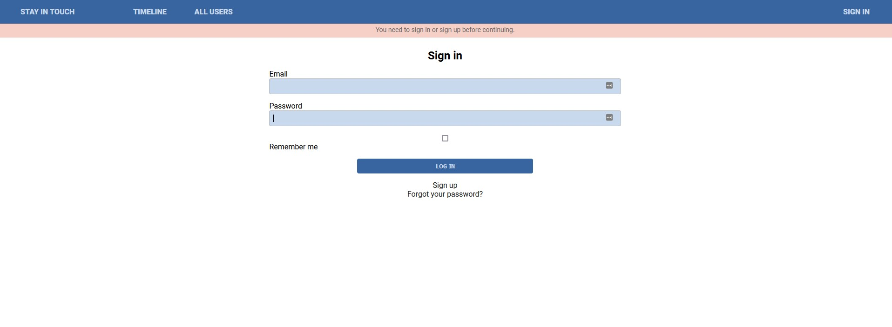
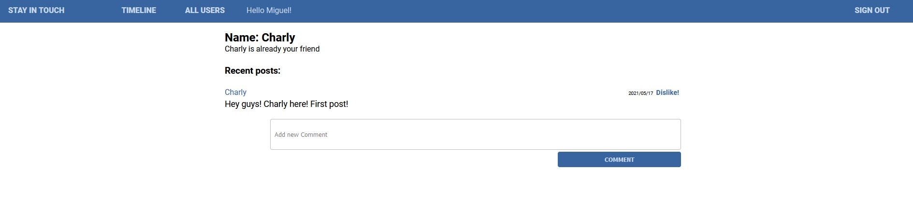
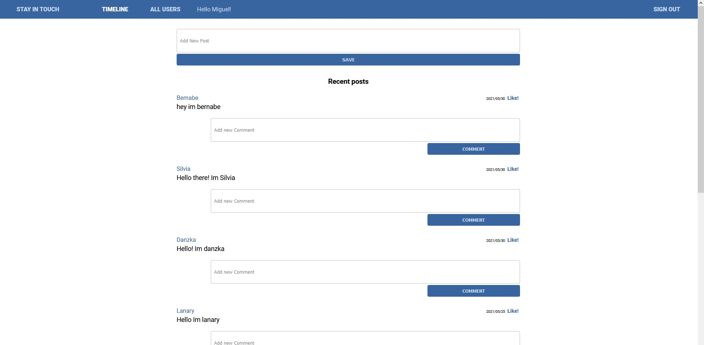

# Stay in touch

> A mini social media app built with Ruby and Rails.





## Built With

- Ruby v2.7.3
- Ruby on Rails v6.1

## Live Demo

TBA


## Getting Started

To get a local copy up and running follow these simple example steps.

### Prerequisites

Ruby: 2.7.3
Rails: 6.1
Postgres: >=12

### Setup

Instal gems with:

```
bundle install
```

Setup database with:

```
   rails db:create
   rails db:migrate
```


### Usage

Start server with:

```
    rails server
```

Open `http://localhost:3000/` in your browser.

### Run tests

```
    rspec --format documentation
```


## Authors

🧑‍💻 **Miguel**
- GitHub: [@meltrust](https://github.com/meltrust)
- Twitter: [@meltrustDVX](https://twitter.com/meltrustDVX)
- LinkedIn: [Miguel(meltrust) Tapia Escalera](https://www.linkedin.com/in/meltrust/)

## 🤝 Contributing
Contributions, issues, and feature requests are welcome!

## Show your support
Give a ⭐️ if you like this project!

## Acknowledgments

- [Micoverse team](https://www.microverse.org/)


## 📝 License

This project is [MIT](LICENSE) licensed.


