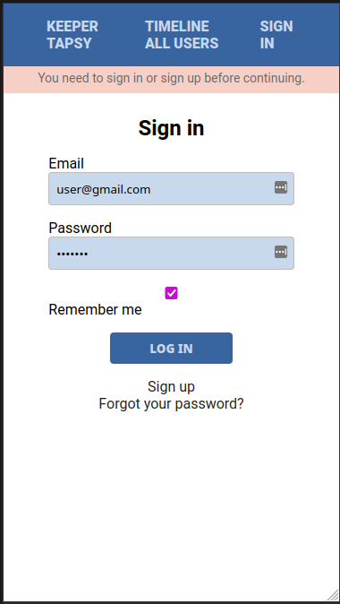
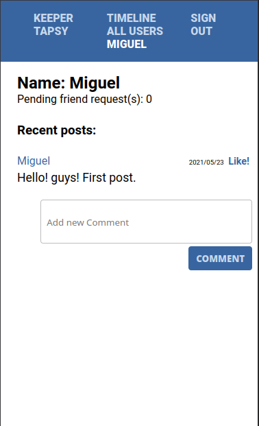
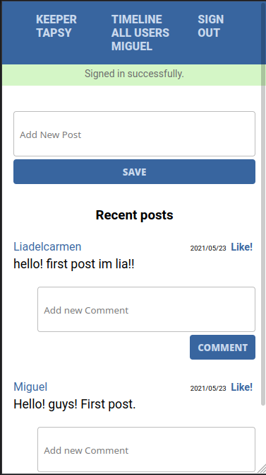

# Keeper-tapsy

> A social media app built with Ruby and Rails under heavy development!

### Login screen 



### User status


### User timeline with friends



## Visit keeper-tapsy now!!

https://keeper-tapsy.herokuapp.com/

## Features

- Ability to log in and authenticate users
- You can sign up, log in, add friends
- You can publish posts, comment on posts
- In your timeline, only your posts and posts from friends show up
- Ability to view all users for now, to be able to add friends

### What's planned for the future

- Ability to post images, videos
- Ability to make posts viewable to public
- UI/UX improvements
- Photos, and the ability to tag people


## Built With

- Ruby v2.7.3
- Ruby on Rails v6.1


### Prerequisites

- Ruby: 2.7.3
- Rails: 6.1
- Postgres: >=12

### Setup development environment on your machine

Install gems with:

```
bundle install
```

Setup database with:

```
   rails db:create
   rails db:migrate
```

Start server with:

```
    rails server
```
Open `http://localhost:3000/` in your browser.


### Run tests

```
    rspec --format documentation
```


## Authors

🧑‍💻 **Miguel**
- GitHub: [@meltrust](https://github.com/meltrust)
- Twitter: [@meltrustDVX](https://twitter.com/meltrustDVX)
- LinkedIn: [Miguel(meltrust) Tapia Escalera](https://www.linkedin.com/in/meltrust/)

## 🤝 Contributing
Contributions, issues, and feature requests are welcome!

## Show your support
Give a ⭐️ if you like this project!


## 📝 License

This project is [MIT](LICENSE) licensed.


