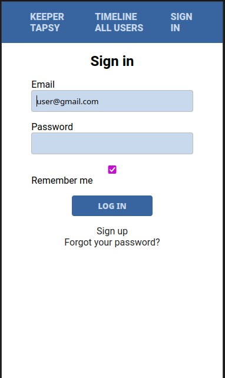
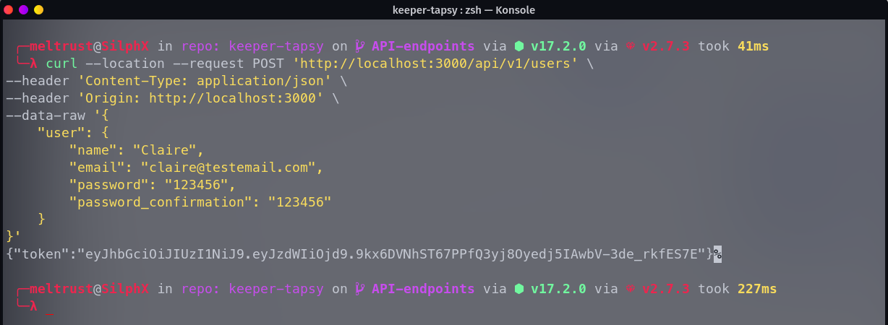
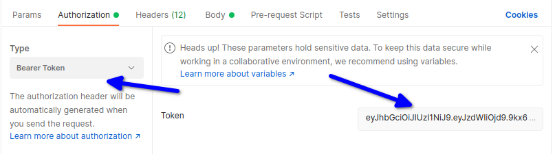
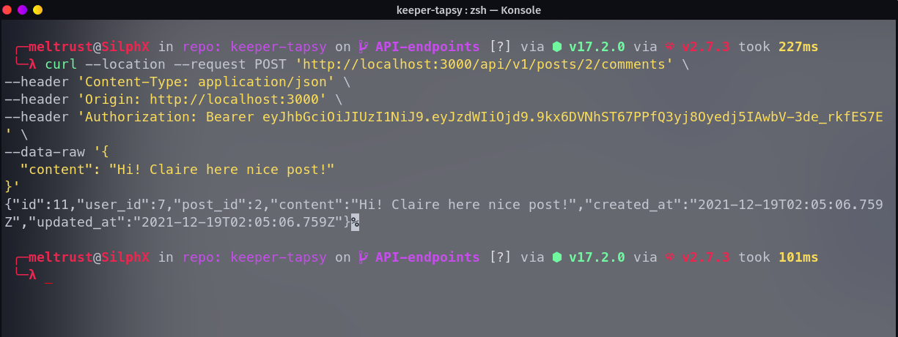

# Keeper-tapsy

> A social media app built with Ruby and Rails under heavy development!

### Login screen 



### User status


### User timeline with friends


## Visit keeper-tapsy now!!

https://keeper-tapsy.herokuapp.com/

## Features

- Ability to log in and authenticate users
- You can sign up, log in, add friends
- You can publish posts, comment on posts
- In your timeline, only your posts and posts from friends show up
- Ability to view all users for now, to be able to add friends
- *New* API endpoints for displaying posts.
- *New* API endpoints for displaying posts' comments.
- *New* API endpoints for creating a user and get an authenticity token.
- *New* API endpoints for creating comments as an authenticated user.

### What's planned for the future

- Ability to post images, videos
- Ability to make posts viewable to public
- UI/UX improvements
- Photos, and the ability to tag people


## Built With

- Ruby v2.7.3
- Ruby on Rails v6.1Its n
- JWT encoder/decoder for API authentication


### Prerequisites

- Ruby: 2.7.3
- Rails: 6.1
- Postgres: >=12

### Setup development environment on your machine

Install gems with:

```
bundle install
```

Setup database with:

```
   rails db:create
   rails db:migrate
```

Start server with:

```
    rails server
```
Open `http://localhost:3000/` in your browser.


### Run tests

```
    rspec --format documentation
```

## How to use the API (GET)

### Get all posts

```http://localhost:3000/api/v1/posts```

### List comments for given post

```http://localhost:3000/api/v1/posts/:post_id/comments```

The post referenced by :post_id must exist.

## How to use the API (POST)

### First create a user, you can create the user using this url.

 ```http://localhost:3000/api/v1/users```

 

### If using Postman, in the 'Authorization' section choose 'Bearer Token' and paste it there.



### Now you can create a new comment by using the token you got from last step and paste it into the request.  
 
```http://localhost:3000/api/v1/posts/:post_id/comments```

The post referenced by :post_id must exist.




## Authors

🧑‍💻 **Miguel**
- GitHub: [@meltrust](https://github.com/meltrust)
- Twitter: [@meltrustDVX](https://twitter.com/meltrustDVX)
- LinkedIn: [Miguel(meltrust) Tapia Escalera](https://www.linkedin.com/in/meltrust/)

🧑‍💻 **Amal Hersi**

- GitHub: [Amal Hersi](https://github.com/Amalcxc)
- Twitter: [@Amalcx4](https://twitter.com/home?lang=en)
- LinkedIn: [Amal Hersi](https://www.linkedin.com/in/amal-hersi-a29583205/)

## 🤝 Contributing
Contributions, issues, and feature requests are welcome!

## Show your support
Give a ⭐️ if you like this project!


## 📝 License

This project is [MIT](LICENSE) licensed.


